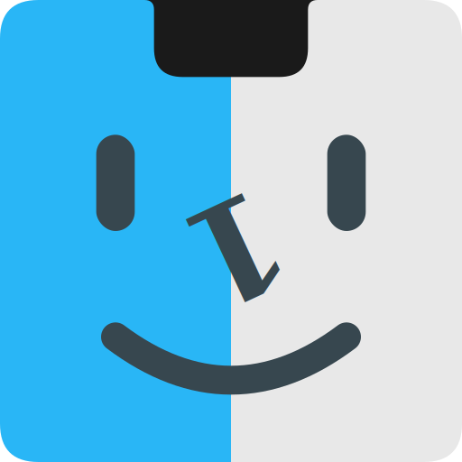

<h1 align="center">
  <br>
  
  <br>
  Just1Notch
  <br>
</h1>

<p align="center">
  <b>让你的 MacBook 刘海变得有趣起来！</b>
</p>

<p align="center">
  
  
  
</p>

---

**Just1Notch** 是一款让 MacBook 刘海焕发新生的应用！告别无聊的状态栏，你的刘海将变身为动态音乐控制中心，配备炫酷的可视化效果和完整的音乐控制功能。不仅如此，Just1Notch 还提供日历集成、支持 AirDrop 的文件寄存区、完整的 macOS HUD 替换等更多功能！

> 本项目基于 [boring.notch](https://github.com/TheBoredTeam/boring.notch) 进行二次开发和本地化优化。

---

## 功能特性

- 🎧 **音乐播放控制** - 动态音乐控制中心，支持可视化效果
- 📆 **日历集成** - 快速查看日程安排
- ☑️ **提醒事项** - 集成系统提醒事项
- 📷 **镜像功能** - 快速自拍镜像
- 🔋 **电池指示** - 充电状态和电量百分比显示
- 👆🏻 **手势控制** - 可自定义的手势操作
- 📚 **文件寄存区** - 支持 AirDrop 的临时文件存放
- 🖥️ **多显示器支持** - 适配不同尺寸的显示器
- 🎚️ **系统 HUD 替换** - 音量、亮度、键盘背光的美化显示

---

## 系统要求

- **macOS 14 Sonoma** 或更高版本
- Apple Silicon 或 Intel Mac

---

## 安装

### 从源码构建

1. **克隆仓库**：
   ```bash
   git clone https://github.com/your-username/Just1Notch.git
   cd Just1Notch
   ```

2. **在 Xcode 中打开项目**：
   ```bash
   open boringNotch.xcodeproj
   ```

3. **构建并运行**：
   - 点击 "Run" 按钮或按 `Cmd + R`

> [!IMPORTANT]
> 由于没有 Apple 开发者账号，首次启动时会显示"来自身份不明的开发者"的弹窗。
> 1. 点击 **好** 关闭弹窗
> 2. 打开 **系统设置** > **隐私与安全性**
> 3. 向下滚动，点击应用旁边的 **仍要打开**
> 4. 如有提示，确认你的选择
>
> 此操作只需执行一次。

---

## 使用方法

- 启动应用后，你的刘海就变得有趣了
- 将鼠标悬停在刘海上，查看展开后的更多功能
- 使用控制按钮管理你的音乐播放
- 点击菜单栏图标自定义你的刘海设置

---

## 路线图

- [x] 音乐播放实时活动 🎧
- [x] 日历集成 📆
- [x] 提醒事项集成 ☑️
- [x] 镜像功能 📷
- [x] 充电指示和电量百分比 🔋
- [x] 可自定义手势控制 👆🏻
- [x] 文件寄存区（支持 AirDrop）📚
- [x] 刘海尺寸自定义 🖥️
- [x] 系统 HUD 替换（音量、亮度、背光）🎚️💡⌨️
- [ ] 蓝牙设备实时活动 🎧
- [ ] 天气集成 ⛅️
- [ ] 自定义布局选项 🛠️
- [ ] 锁屏小组件 🔒
- [ ] 扩展系统 🧩
- [ ] 通知功能（考虑中）🔔

---

## 致谢

本项目基于以下开源项目：

- **[boring.notch](https://github.com/TheBoredTeam/boring.notch)** - 原始项目，提供了核心功能框架
- **[MediaRemoteAdapter](https://github.com/ungive/mediaremote-adapter)** - 支持 macOS 15.4+ 的 Now Playing 功能
- **[NotchDrop](https://github.com/Lakr233/NotchDrop)** - 文件寄存区功能的灵感来源

完整的许可证和归属信息请查看 [Third-Party Licenses](./THIRD_PARTY_LICENSES.md) 文件。

---

## 许可证

本项目基于 [GNU General Public License v3.0](./LICENSE) 开源。

```
Just1Notch - 让你的 MacBook 刘海变得有趣
Copyright (C) 2024

This program is free software: you can redistribute it and/or modify
it under the terms of the GNU General Public License as published by
the Free Software Foundation, either version 3 of the License, or
(at your option) any later version.
```

---

<p align="center">
  用 ❤️ 打造，让 MacBook 刘海不再无聊！
</p>
